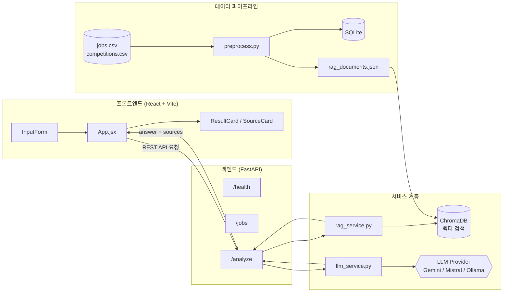

    # CareerFit AI

CareerFit AI는 사용자의 전공, 보유 스킬, 관심 직무를 입력받아 RAG(검색 증강 생성) 기반으로 취업 준비 방향, 추천 역량, 공모전 준비 전략을 제안하는 AI 커리어 분석 서비스입니다.

## 프로젝트 개요

**문제 정의**
- 관심 직무에 어떤 역량이 필요한지 명확히 알기 어렵다.
- 학교에서 준비하는 내용과 실제 실무 요구 역량 사이의 차이를 느낀다.
- 공모전이나 프로젝트를 하더라도 어떤 방향으로 포트폴리오를 쌓아야 할지 막막하다.

**주요 사용자**
- 취업을 준비하는 대학생
- 데이터 분석가, AI/ML 관련 직무를 준비하는 학생

## 기술 스택

| 영역 | 기술 |
|---|---|
| 백엔드 | Python 3.11, FastAPI |
| AI API | Gemini 2.5 Flash-Lite (Mistral, Ollama, HuggingFace로 전환 가능) |
| 데이터 | Pandas, SQLite, ChromaDB |
| 프론트엔드 | React, Vite, Tailwind CSS |
| 실행 환경 | Docker |

## 🏗 아키텍처



**요청 흐름**
1. 사용자가 프론트엔드에서 전공·스킬·관심 직무를 입력한다.
2. `/analyze` 엔드포인트가 요청을 받아 `rag_service.py`로 ChromaDB에서 관련 공고 문서를 검색한다.
3. 검색된 문서를 컨텍스트로 `llm_service.py`가 LLM(Gemini 등)에 요청을 보내 답변을 생성한다.
4. 생성된 답변과 근거 자료(sources)를 함께 프론트엔드로 반환한다.

## 🚀 실행 방법

### Docker로 실행 (권장)

```bash
# 1. 이미지 빌드
docker build -t careerfit-ai ./backend

# 2. 컨테이너 실행
docker run -p 8000:8000 --env-file backend/.env careerfit-ai
```

API 문서: http://localhost:8000/docs

### 로컬 실행

**백엔드**
```bash
cd backend
python -m venv venv
source venv/bin/activate      # Windows: venv\Scripts\activate

pip install -r requirements.txt
cp ../.env.example ../.env    # .env 파일 생성 후 API 키 입력

uvicorn main:app --reload --port 8000
```

**프론트엔드**
```bash
cd frontend
npm install
npm run dev
```

프론트엔드: http://localhost:5173

> 백엔드와 프론트엔드는 각각 별도의 터미널에서 동시에 실행되어야 합니다.

## 📊 데이터 파이프라인

```
CSV (jobs.csv, competitions.csv)
  → Pandas 전처리 (결측치 처리, 중복 제거, 스킬 키워드 표준화)
  → SQLite (구조화 저장, careerfit.db)
  → rag_documents.json (자연어 문서 변환)
  → ChromaDB (벡터 임베딩 및 검색 인덱스)
```

전처리 실행:
```bash
cd backend
python data/preprocess.py
```

## 환경 변수 (`.env`)

`.env.example`을 복사해 `.env`를 만들고 아래 값을 채워주세요.

```bash
GEMINI_API_KEY=your_gemini_api_key_here
MISTRAL_API_KEY=your_mistral_api_key_here
MOCK_MODE=false
LLM_MODEL=gemini-2.5-flash-lite
OLLAMA_BASE_URL=http://localhost:11434
```

- `LLM_MODEL`을 바꾸면 사용하는 LLM을 전환할 수 있습니다 (`gemini-*`, `mistral-*`, `ollama:모델명`, `huggingface:모델명`).
- `MOCK_MODE=true`로 설정하면 실제 API 호출 없이 서버 구조만 확인할 수 있습니다.

## ✨ 주요 기능

- **RAG 기반 역량 분석**: 전공·스킬·관심 직무를 바탕으로 ChromaDB에서 관련 취업 공고를 검색하고, 이를 근거로 맞춤형 커리어 조언을 생성합니다 (`/analyze`).
- **출처 표시**: 어떤 공고 데이터를 참고했는지 `sources`로 함께 반환하여 답변의 신뢰도를 높입니다.
- **공고 조회 API**: 채용 공고 목록 및 상세 정보를 조회할 수 있습니다 (`/jobs`, `/jobs/{id}`).
- **헬스 체크**: 서버 및 컨테이너 상태 확인용 엔드포인트를 제공합니다 (`/health`).
- **Mock Mode**: API 한도 초과 시 `MOCK_MODE=true`로 실제 LLM 호출 없이 폴백할 수 있습니다.
- **멀티 LLM Provider 지원**: `LLM_MODEL` 값에 따라 Gemini, Mistral, Ollama, HuggingFace 모델로 손쉽게 전환 가능합니다.

## 📁 프로젝트 구조

```
careerfit-ai/
├── backend/                  # FastAPI 서버
│   ├── main.py               # 앱 엔트리포인트, 라우터 등록
│   ├── routers/               # /health, /jobs, /analyze 라우터
│   ├── services/               # rag_service.py, llm_service.py
│   ├── data/                  # jobs.csv, competitions.csv, preprocess.py, rag_documents.json
│   └── Dockerfile
├── frontend/                  # React UI
│   └── src/
│       ├── App.jsx            # 상태 관리, API 요청
│       └── components/        # InputForm, ResultCard, SourceCard
└── docs/                      # 기획·개발 문서 모음
```

## 🔮 향후 개선

- [ ] 이력서 PDF 업로드 후 자동 역량 추출
- [ ] 공모전 마감일 알림 기능
- [ ] RAG 검색 품질 평가 지표 추가 (Ragas 등)

## 진행 현황

- [x] 1일차: 프로젝트 기획 및 개발 환경 세팅
- [x] 2일차: FastAPI 서버 구축 및 Gemini API 연결
- [x] 3일차: 데이터 파이프라인 구축
- [x] 4일차: RAG 기반 서비스 + React UI
- [x] 5일차: Docker + 백엔드 배포 (Render)


## 📝 개발 과정
가장 어려웠던 부분은 백엔드·AI API·데이터·프론트엔드 등 각 기술 스택이 서비스 안에서 정확히 어떤 역할을 하는지 이해하는 것이었습니다. 특히 Docker 환경을 구축하는 과정에서 WSL 관련 이슈로 애를 먹었는데, 관련 문서를 찾아보며 하나씩 해결해 나갔습니다.
---

## Demo

- Backend API (Render): https://careerfit-ai-new-dmop.onrender.com/docs
  Swagger UI에서 `/health`, `/jobs`, `/analyze` API를 직접 테스트해볼 수 있습니다.
  (Render 무료 인스턴스는 비활성 시 슬립 모드로 전환되어, 첫 요청 시 응답까지 최대 50초 정도 걸릴 수 있습니다.)
- Frontend: 아직 별도 배포되지 않았습니다. 로컬에서 아래 "실행 방법"을 참고해 `npm run dev`로 실행해주세요.

---

## Developer

- Name: 승엽
- Role: Backend / AI Service Development
- GitHub: [@yuj55015](https://github.com/yuj55015)
- Email: yuj55015@gmail.com

    
